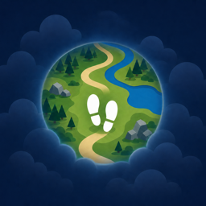
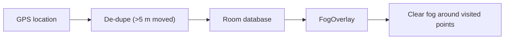

<div align="center">



# FogWalk

**Reveal the world as you walk it.**

A fog-of-war map for real life. FogWalk covers the map in a blue fog and permanently clears it everywhere you walk, so you can see at a glance how much of your city, town, or the wild you've actually explored.

[](https://github.com/lerdeljan17/fogwalk/actions/workflows/ci.yml)
[](https://github.com/lerdeljan17/fogwalk/releases/latest)

### [Download the latest APK](https://github.com/lerdeljan17/fogwalk/releases/latest)

</div>

---

## What it does

- Shows an OpenStreetMap map of wherever you are.
- Lays a translucent **blue fog** over the whole map.
- As you walk, a soft circle of fog is **cleared** around your path and stays cleared forever.
- Works **anywhere** - city streets, trails, open nature - because it uses raw GPS plus OpenStreetMap tiles. **No API keys, no Google account, no Play Services.**
- Keeps recording in the background via a foreground service, so the fog clears even with the screen off.
- Your explored points are stored locally on-device (Room database) and survive restarts.

## How the fog works

The reveal effect lives in [`FogOverlay`](app/src/main/java/com/fogwalk/map/FogOverlay.kt):

1. Every visited GPS point is stored (de-duplicated so we don't pile up points when you stand still).
2. On each map draw, an offscreen bitmap is filled with the fog color.
3. For each visited point currently on screen, a transparent hole is punched into the fog using a `PorterDuff.CLEAR` radial gradient, giving soft fading edges.
4. The reveal radius is defined in real-world meters and converted to pixels for the current latitude and zoom, so cleared areas stay geographically consistent as you zoom and pan.



## Tech stack

| Area | Choice |
| --- | --- |
| Language | Kotlin |
| Map | [osmdroid](https://github.com/osmdroid/osmdroid) (OpenStreetMap) |
| Location | Android `LocationManager` in a foreground `Service` |
| Storage | Room |
| Min / target SDK | 24 / 34 |
| Tests | JUnit + Robolectric |
| CI/CD | GitHub Actions |

## Building locally

You need JDK 17 and the Android SDK (platform 34, build-tools 34.0.0).

```bash
# Run the unit tests
./gradlew testDebugUnitTest

# Build an installable release APK
./gradlew assembleRelease
# -> app/build/outputs/apk/release/app-release.apk
```

Create a `local.properties` pointing at your SDK if Gradle can't find it:

```properties
sdk.dir=/path/to/Android/sdk
```

## Tests

Unit tests live in [`app/src/test/java/com/fogwalk`](app/src/test/java/com/fogwalk):

- `GeoUtilsTest` - haversine distances, meters-per-pixel projection math, and the movement threshold.
- `FogRevealTest` - the pixel math that decides whether a spot is inside any reveal radius.
- `VisitedRepositoryTest` - Room persistence and de-duplication (Robolectric + in-memory database).

## CI/CD

Defined in [`.github/workflows/ci.yml`](.github/workflows/ci.yml). On every push and pull request it:

1. Runs the unit tests (these gate everything else).
2. Builds a signed, installable release APK.
3. Uploads the APK as a workflow artifact.
4. On pushes to `main`, publishes a **GitHub Release** (`v1.0.<run number>`) with the APK attached.

The [latest release](https://github.com/lerdeljan17/fogwalk/releases/latest) link above always points at the newest build.

> CI signs the release APK with a stable keystore stored in GitHub Actions secrets, so every published release shares the same signature and increasing `versionCode` and updates in place. Local/contributor builds without those secrets fall back to the Android debug key automatically.

## Permissions

FogWalk requests location (including background location) and notification permissions. Location is used solely to draw your path on the map and is stored only on your device.

## License

MIT - see [LICENSE](LICENSE).
